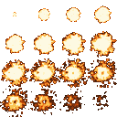

Explosions
==========

In this chapter, you will add explosions to the game.
This will require a lot of changes.
Putting everything in the right place is a bit of a challenge.

The image
---------

Use an explosion image with 32x32 tiles for each frame from `opengameart.org/content/32x32-explosion <https://opengameart.org/content/32x32-explosion>`__ . The image contains 16 frames, 4 per row.

Download the image file :download:`explosion_pixelfied.png` and save it in the `tiles/` folder.

Changes to the game
-------------------

In `game.py` define a class that manages the explosions:

.. code:: python3

    class Explosion(BaseModel):
        x: int
        y: int
        max_frame: int = 16
        max_delay: int = 5
        delay: int = 0
        frame: int = 0
        complete: bool = False

Reference the class in `DungeonGame`:

.. code:: python3

    explosions: list[Explosion] = []

Create explosions
-----------------

Whenever something should blow up, create a new explosion object:

.. code:: python3

    game.explosions.append(Explosion(x=x, y=y))

Drawing the graphics
--------------------

In `main.py` load the image and add it to the dictionary with other tiles:

.. code:: python3

    images["explosion"] = read_image("tiles/explosion_pixelfied.png")

You will also need a function that draws an explosion:

.. code:: python3

    def draw_explosion(frame, explosion, images):
        framex = explosion.frame % 4
        framey = explosion.frame // 4
        tile = images["explosion"][framey * TILE_SIZE:(framey + 1) * TILE_SIZE, framex * TILE_SIZE:(framex + 1) * TILE_SIZE]
        draw_tile(frame, x=explosion.x, y=explosion.y, image=tile)
        ...
        # increase the frame here and set the explosion to complete if necessary
        # also handle delays here

Call `draw_explosion()` in the `draw()` function, once for each explosion.

Cleaning up
-----------

You might want to remove the finished explosions:

.. code:: python3

    def clean_explosions(game):
        """updates each explosion in the game"""
        result = []
        ...
        game.explosions = result

Call it in the main while loop.
