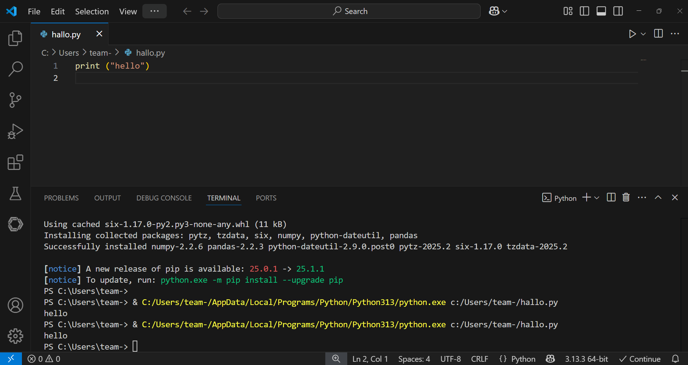

Installation
============

For this course you need to install two programs: **Python** and **Visual Studio Code**.
In this chapter you find installation instructions for both.

Install Python
--------------

Download Python 3.13 from `www.python.org/downloads/ <https://www.python.org/downloads/>`__ .
Follow the installation instructions for your operating system.

.. hint::

   On Windows, make sure to check the box *"Add Python to PATH"*:

   .. figure:: ../images/path.png

Test the installation
---------------------

1. open a terminal (bash, zsh or PowerShell).
2. type ``python`` and press ``ENTER``

You should see the Python prompt >>> and the version of your Python installation.

Install Visual Studio Code
--------------------------
Visual Studio Code (VS Code) is a lightweight but powerful editor that supports debugging, syntax highlighting and comes with extensions for most programming languages, including Python.

Download VS Code from `code.visualstudio.com/download <https://code.visualstudio.com/download>`__ .
Run the installer and use the standard options.

Install the Python extension for VS Code
----------------------------------------

1. open VS Code.
2. Press ``Ctrl + Shift + X`` to open the extensions panel (or press the button showing four squares on the left).
3. search for *python* and install the official extension by Microsoft.

VS Code should be able to find an installed Python interpreter most of the time.
If the extension finds Python, you should see a Python version (e.g. 3.13.3) in the bottom right corner of the window. 
If not, click the field on the bottom right to select a Python version manually.

Test Python in VS Code
----------------------

The final step is to test whether Python is really working.

1. create a new file in VS Code (with ``Ctrl + n`` or the menu) and save it with the name ``hello.py``.
Make sure that there is nothing after the ``.py`` in the file name.
2. instert the line: ``print("hello world")``
3. click the **Run** button (arrow icon) at the top right.

A terminal should open at the bottom, showing the output of the program.
If you see **hello world"** in the terminal, everything has worked.
Congratulations!
