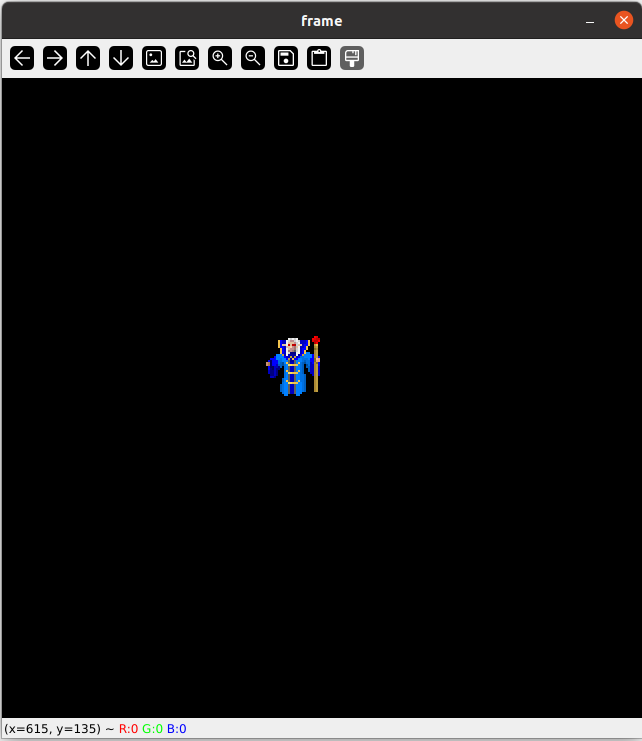
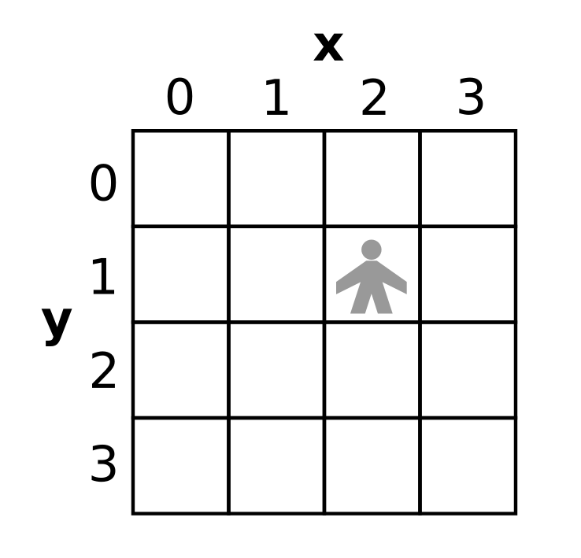

The Prototype
=============

.. topic:: Goal

   Execute a Python program that 
   draws 2D graphics and processes keyboard input.

To get your programming efforts off the ground quickly,
you will start with a minimalistic dungeon game.
In the game you move a graphical icon using the keyboard.

Download the Code
-----------------

You will need a couple of files to run a minimalistic program:

- :download:`main.py <../prototype/main.py>` : the graphical interface for the game
- :download:`game.py <../prototype/game.py>` : the game mechanics
- :download:`requirements.txt <../prototype/requirements.txt>` : a list of libraries
- :download:`tile_images.zip <../prototype/tile_images.zip>` : the graphics

Download all files and place them in the same folder.
Unzip the tile images and place the folder ``tiles/`` next to the Python files (without an extra subfolder).

Install Dependencies
--------------------

You need to install several libraries.
Open a terminal in VS Code or through your operating system.
Go to the folder containing the files with:

::

   cd my_project_folder/

and type:

::

   pip install -r requirements.txt

Execute the prototype
---------------------

Open the file ``main.py`` in VS Code and press the **Run** button (▶️).

Alternatively, open a terminal in the folder with the prototype code. Run the game with:

::

   python main.py

You should see a screen where you can move a character with the keys **A and D**:

The grid model
--------------

To understand what is going on, it is helpful to know that everything in your dungeon will have x and y coordinates.
Most of the time, you will use coordinates in a **x/y grid that refers to positions in the dungeon**, not pixels on the screen.
The top left position is `0/0`:

Review the code
---------------

Open the file ``game.py`` in VS Code. Inspect the code. Take notes about:

* code that you understand
* code that you do not understand
* questions that you have

The file ``main.py`` contains code for the graphics. We will look into it at a later time.

Complete the movement
---------------------

So far, the character can only move left and right.
Add code that moves the character up and down.

Run the program and make sure it works.
