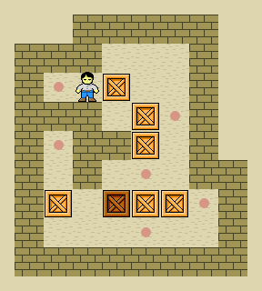

Pushable Boxes
==============

`By Carloseow at English Wikipedia, CC BY 3.0 <https://commons.wikimedia.org/w/index.php?curid=35846111>`__

.. topic:: Sokoban

   This optional challenge is a hommage to the 1981 game **Sokoban by Hiroyuki Imabayashi**.
   In the game, the player needs to push all boxes to special floor tiles.
   The trouble is that boxes cannot be pulled, only pushed.

   Sounds interesting? **Let's add boxes to the dungeon!**

How to plan a complex feature?
------------------------------

The pushable boxes are certainly more complex than other features you have implemented so far.
The trick to program such features is **not to start programming too early**.
We will do a bit of planning in order to cut the feature into smaller pieces.

.. hint::

    It helps a lot to draw possible situations on paper and play through what should happen.
    It also helps to play a level of Sokoban. There are plenty of online versions of it.

Border cases
------------

One approach is to enumerate possible situations that your feature needs to cover.
Of course, there are close to *infinite* possibilities to arrange boxes and walls and the player.
You need to come up with a smaller set that is *representative*.
We call such representative situations **border cases**.
The border cases guide you in implementing and testing your program.

Here are a few example border cases for the pushable boxes:

- there is no box in front of the player. The player moves normally.
- there is a box in front of the player. Behind the box there is a wall. The box and player do not move.
- there is a box and an empty space behind it. Both player and box move.
- there is a box behind a box. The boxes and the player do not move.
- there is a coin behind a box. **What should happen in this case?**

.. note::

    What other border cases can you think of that are needed for the behavior ob boxes in your game?

Implementation hints
--------------------

There will be three positions in play to cover the box behavior:

- the position of the player
- the position of the box
- the position behind the box

You will need to have or calculate these three positions before you can implement any of the logic.

You might also want to implemente the following helper functions:

.. code:: python3

    def get_next_position(x, y, direction) -> tuple[int, int]:
        ...

    def can_box_move(game, x, y, direction) -> bool:
        ...

    def can_player_move(game, x, y, direction) -> bool:
        ...

Challenge
---------

Implement one of the original Sokoban levels as a puzzle stage in your dungeon.
