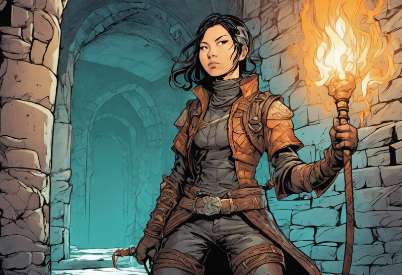

Dungeon Explorer
================

**A Step-by-Step Tutorial for writing a 2D game in Python**

**by Dr. Kristian Rother**

|image0|

*image created with dreamstudio.ai*

Who is this tutorial for?
-------------------------

I wrote this tutorial with beginner and intermediate Python learners in mind.

As a beginner, you will probably need some guidance during this tutorial.
If you would like to start learning Python by yourself, check out the material on `www.academis.eu/python_basics/ <https://www.academis.eu/python_basics/>`__

With some experience you can work through the exercises on your own
and come up with new, cool features.
You might also discover situations where you can start trying out advanced development techniques, such as testing, refactoring and OOP patterns.

In both cases, I hope you have fun creating a complete Python game.
**May the source be with you.**

Contents
--------

.. toctree::
   :maxdepth: 2
   :titlesonly:

   chapters/installation.rst
   chapters/prototype.rst
   chapters/floor.rst
   chapters/walls.rst
   chapters/stairs.rst
   chapters/smooth.rst
   chapters/coins.rst
   chapters/health.rst
   chapters/traps.rst
   chapters/lookup_table.rst
   chapters/keys.rst
   chapters/unlock_doors.rst
   chapters/teleporters.rst
   chapters/switch.rst
   chapters/split_function.rst
   chapters/fireballs.rst
   chapters/healing_potion.rst
   chapters/skeletons.rst
   chapters/levels.rst
   chapters/more_monsters.rst
   chapters/music.rst
   chapters/title_screen.rst

Advanced Topics
---------------

.. toctree::
   :maxdepth: 1
   :titlesonly:

   chapters/design_patterns/README.rst
   chapters/lesson_plans.rst

.. topic:: Source Code

   `github.com/krother/dungeon_explorer <https://github.com/krother/dungeon_explorer>`__

License
-------

© 2025 Dr. Kristian Rother

The Python code is distributed under the conditions of the MIT License. See :download:`LICENSE.TXT` for details

The text can be used under the conditions of the Creative Commons Attribution Share-alike License 4.0 (CC-BY-SA 4.0).
See `creativecommons.org <https://creativecommons.org/licenses/by-sa/4.0/>`__ for details

The tile graphics are taken from `opengameart.org/content/dungeon-crawl-32x32-tiles <https://opengameart.org/content/dungeon-crawl-32x32-tiles>`__ set under CC:0. See :download:`ART_LICENSE.TXT` for a list of authors.

.. topic:: Contributors

   An initial game was developed during my Advanced Python courses at the SRH Berlin see `github.com/krother/ams_dungeon_explorer <https://github.com/krother/ams_dungeon_explorer>`__.
   I would like to thank the following people for their active contributions:
   
   Omar Saleh, Sultan Mirzoev, Ibrahim Khalil, Martin Esposito, Abdullah Aljamal, Chanhwan Park, Aritha Bandara, Godfrey Rukundo, Hilary Mubwandarikwa, Jonathan Estephan, Prabraj Singh, Andrei Madiarov, Muhammad Mujtaba Ahmed, Nair Roshan, Arnold Joseph, Samuel Malayil Verghese, Karan Zaveri, Harshetha Murthy, Shreyaasri Prakash, Pradyumna SR, Venkat Chavan, Chethan DV, Bhavya Babuta, Deepshikha, Francisco Saavedra Gonzalez, Azad Aliyev, German Sarychev, Juma Buge Abbas, Sasha Rykov, Chen-Yu Liu, Varun Shah, Hemanth Kumar Karthikeyan, Khushal Khare, Nikhil Gadekar, Ipshita Singh

Contact
-------

`kristian.rother@posteo.de`

